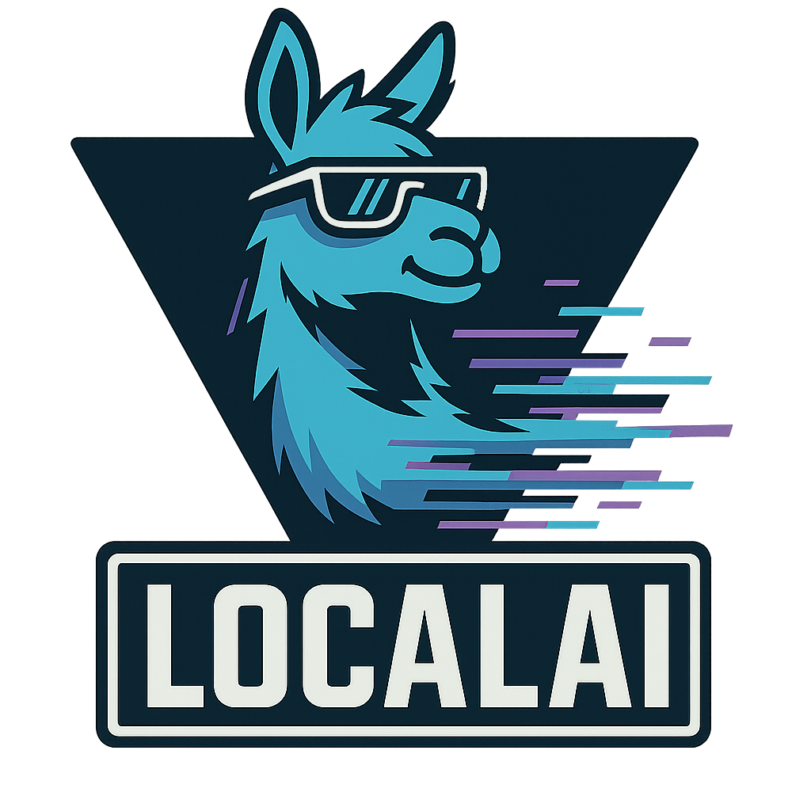
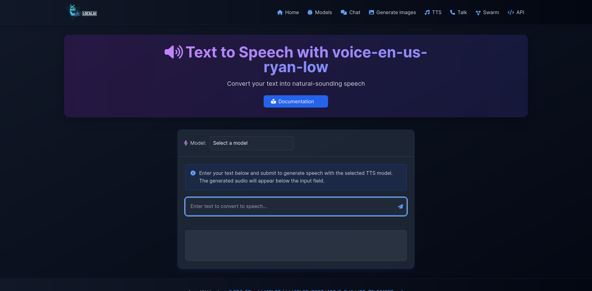
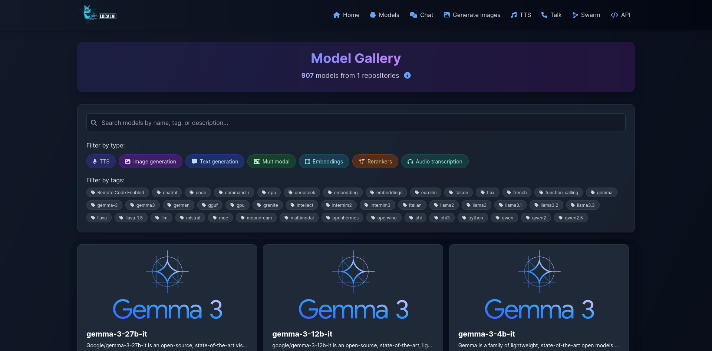
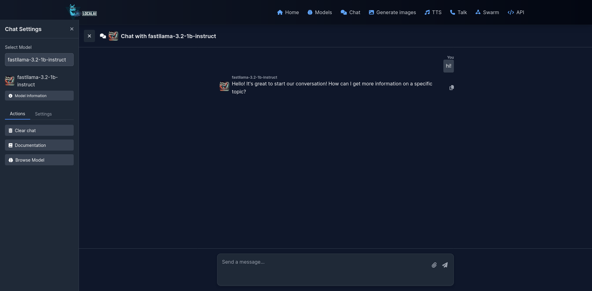
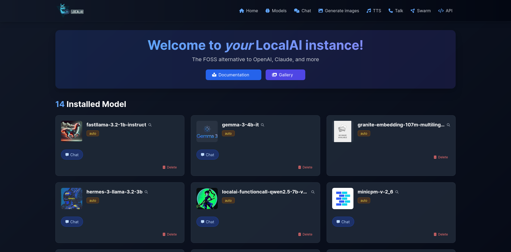
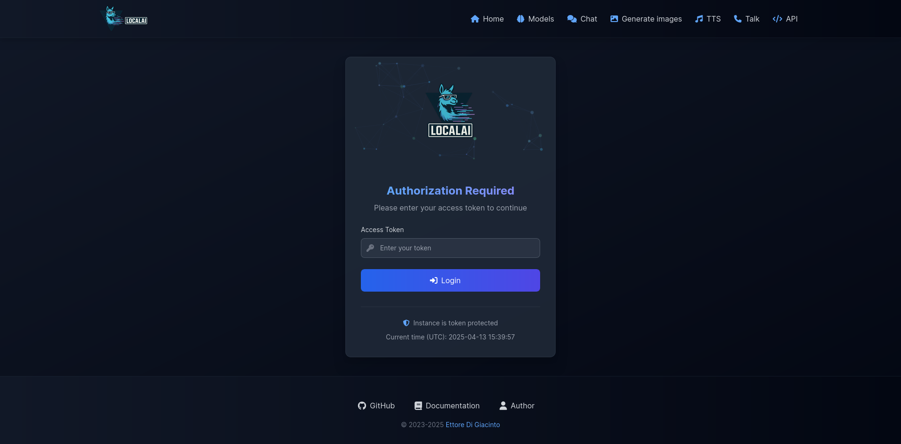
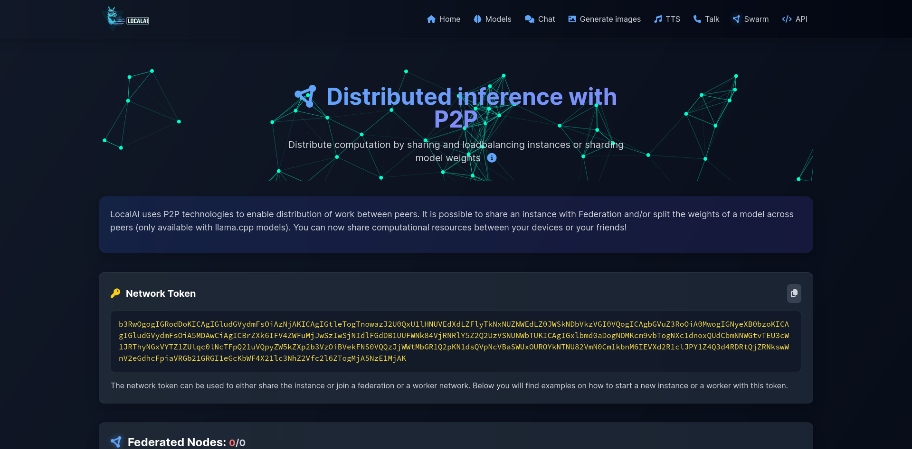

<h1 align="center">
  <br>
   <br>
<br>
</h1>

<p align="center">
<a href="https://github.com/go-skynet/LocalAI/fork" target="blank">

</a>
<a href="https://github.com/go-skynet/LocalAI/stargazers" target="blank">

</a>
<a href="https://github.com/go-skynet/LocalAI/pulls" target="blank">

</a>
<a href='https://github.com/go-skynet/LocalAI/releases'>

</a>
</p>

<p align="center">
<a href="https://hub.docker.com/r/localai/localai" target="blank">

</a>
<a href="https://quay.io/repository/go-skynet/local-ai?tab=tags&tag=latest" target="blank">

</a>
</p>

<p align="center">
<a href="https://twitter.com/LocalAI_API" target="blank">

</a>
<a href="https://discord.gg/uJAeKSAGDy" target="blank">

</a>
</p>

<p align="center">
<a href="https://trendshift.io/repositories/5539" target="_blank"></a>
</p>

> :bulb: Get help - [❓FAQ](https://localai.io/faq/) [💭Discussions](https://github.com/go-skynet/LocalAI/discussions) [:speech_balloon: Discord](https://discord.gg/uJAeKSAGDy) [:book: Documentation website](https://localai.io/)
>
> [💻 Quickstart](https://localai.io/basics/getting_started/) [🖼️ Models](https://models.localai.io/) [🚀 Roadmap](https://github.com/mudler/LocalAI/issues?q=is%3Aissue+is%3Aopen+label%3Aroadmap) [🌍 Explorer](https://explorer.localai.io) [🛫 Examples](https://github.com/mudler/LocalAI-examples) Try on 
[](https://t.me/localaiofficial_bot)

[](https://github.com/go-skynet/LocalAI/actions/workflows/test.yml)[](https://github.com/go-skynet/LocalAI/actions/workflows/release.yaml)[](https://github.com/go-skynet/LocalAI/actions/workflows/image.yml)[](https://github.com/go-skynet/LocalAI/actions/workflows/bump_deps.yaml)[](https://artifacthub.io/packages/search?repo=localai)

**LocalAI** is the free, Open Source OpenAI alternative. LocalAI act as a drop-in replacement REST API that's compatible with OpenAI (Elevenlabs, Anthropic... ) API specifications for local AI inferencing. It allows you to run LLMs, generate images, audio (and not only) locally or on-prem with consumer grade hardware, supporting multiple model families. Does not require GPU. It is created and maintained by [Ettore Di Giacinto](https://github.com/mudler).


## 📚🆕 Local Stack Family

🆕 LocalAI is now part of a comprehensive suite of AI tools designed to work together:

<table>
  <tr>
    <td width="50%" valign="top">
      <a href="https://github.com/mudler/LocalAGI">
        
      </a>
    </td>
    <td width="50%" valign="top">
      <h3><a href="https://github.com/mudler/LocalAGI">LocalAGI</a></h3>
      <p>A powerful Local AI agent management platform that serves as a drop-in replacement for OpenAI's Responses API, enhanced with advanced agentic capabilities.</p>
    </td>
  </tr>
  <tr>
    <td width="50%" valign="top">
      <a href="https://github.com/mudler/LocalRecall">
        
      </a>
    </td>
    <td width="50%" valign="top">
      <h3><a href="https://github.com/mudler/LocalRecall">LocalRecall</a></h3>
      <p>A REST-ful API and knowledge base management system that provides persistent memory and storage capabilities for AI agents.</p>
    </td>
  </tr>
</table>

## Screenshots


| Talk Interface | Generate Audio |
| --- | --- |
|  |  |

| Models Overview | Generate Images |
| --- | --- |
|  |  |

| Chat Interface | Home |
| --- | --- |
|  |  |

| Login | Swarm |
| --- | --- |
| |  |

## 💻 Quickstart

Run the installer script:

```bash
# Basic installation
curl https://localai.io/install.sh | sh
```

For more installation options, see [Installer Options](https://localai.io/docs/advanced/installer/).

### macOS Download:

<a href="https://github.com/mudler/LocalAI/releases/latest/download/LocalAI.dmg">
  
</a>

Or run with docker:

> **💡 Docker Run vs Docker Start**
> 
> - `docker run` creates and starts a new container. If a container with the same name already exists, this command will fail.
> - `docker start` starts an existing container that was previously created with `docker run`.
> 
> If you've already run LocalAI before and want to start it again, use: `docker start -i local-ai`

### CPU only image:

```bash
docker run -ti --name local-ai -p 8080:8080 localai/localai:latest
```

### NVIDIA GPU Images:

```bash
# CUDA 12.0
docker run -ti --name local-ai -p 8080:8080 --gpus all localai/localai:latest-gpu-nvidia-cuda-12

# CUDA 11.7
docker run -ti --name local-ai -p 8080:8080 --gpus all localai/localai:latest-gpu-nvidia-cuda-11

# NVIDIA Jetson (L4T) ARM64
docker run -ti --name local-ai -p 8080:8080 --gpus all localai/localai:latest-nvidia-l4t-arm64
```

### AMD GPU Images (ROCm):

```bash
docker run -ti --name local-ai -p 8080:8080 --device=/dev/kfd --device=/dev/dri --group-add=video localai/localai:latest-gpu-hipblas
```

### Intel GPU Images (oneAPI):

```bash
docker run -ti --name local-ai -p 8080:8080 --device=/dev/dri/card1 --device=/dev/dri/renderD128 localai/localai:latest-gpu-intel
```

### Vulkan GPU Images:

```bash
docker run -ti --name local-ai -p 8080:8080 localai/localai:latest-gpu-vulkan
```

### AIO Images (pre-downloaded models):

```bash
# CPU version
docker run -ti --name local-ai -p 8080:8080 localai/localai:latest-aio-cpu

# NVIDIA CUDA 12 version
docker run -ti --name local-ai -p 8080:8080 --gpus all localai/localai:latest-aio-gpu-nvidia-cuda-12

# NVIDIA CUDA 11 version
docker run -ti --name local-ai -p 8080:8080 --gpus all localai/localai:latest-aio-gpu-nvidia-cuda-11

# Intel GPU version
docker run -ti --name local-ai -p 8080:8080 localai/localai:latest-aio-gpu-intel

# AMD GPU version
docker run -ti --name local-ai -p 8080:8080 --device=/dev/kfd --device=/dev/dri --group-add=video localai/localai:latest-aio-gpu-hipblas
```

For more information about the AIO images and pre-downloaded models, see [Container Documentation](https://localai.io/basics/container/).

To load models:

```bash
# From the model gallery (see available models with `local-ai models list`, in the WebUI from the model tab, or visiting https://models.localai.io)
local-ai run llama-3.2-1b-instruct:q4_k_m
# Start LocalAI with the phi-2 model directly from huggingface
local-ai run huggingface://TheBloke/phi-2-GGUF/phi-2.Q8_0.gguf
# Install and run a model from the Ollama OCI registry
local-ai run ollama://gemma:2b
# Run a model from a configuration file
local-ai run https://gist.githubusercontent.com/.../phi-2.yaml
# Install and run a model from a standard OCI registry (e.g., Docker Hub)
local-ai run oci://localai/phi-2:latest
```

> ⚡ **Automatic Backend Detection**: When you install models from the gallery or YAML files, LocalAI automatically detects your system's GPU capabilities (NVIDIA, AMD, Intel) and downloads the appropriate backend. For advanced configuration options, see [GPU Acceleration](https://localai.io/features/gpu-acceleration/#automatic-backend-detection).

For more information, see [💻 Getting started](https://localai.io/basics/getting_started/index.html)

## 📰 Latest project news

- October 2025: 🔌 [Model Context Protocol (MCP)](https://localai.io/docs/features/mcp/) support added for agentic capabilities with external tools
- September 2025: New Launcher application for MacOS and Linux, extended support to many backends for Mac and Nvidia L4T devices. Models: Added MLX-Audio, WAN 2.2. WebUI improvements and Python-based backends now ships portable python environments.
- August 2025: MLX, MLX-VLM, Diffusers and llama.cpp are now supported on Mac M1/M2/M3+ chips ( with `development` suffix in the gallery ): https://github.com/mudler/LocalAI/pull/6049 https://github.com/mudler/LocalAI/pull/6119 https://github.com/mudler/LocalAI/pull/6121 https://github.com/mudler/LocalAI/pull/6060
- July/August 2025: 🔍 [Object Detection](https://localai.io/features/object-detection/) added to the API featuring [rf-detr](https://github.com/roboflow/rf-detr)
- July 2025: All backends migrated outside of the main binary. LocalAI is now more lightweight, small, and automatically downloads the required backend to run the model. [Read the release notes](https://github.com/mudler/LocalAI/releases/tag/v3.2.0)
- June 2025: [Backend management](https://github.com/mudler/LocalAI/pull/5607) has been added. Attention: extras images are going to be deprecated from the next release! Read [the backend management PR](https://github.com/mudler/LocalAI/pull/5607).
- May 2025: [Audio input](https://github.com/mudler/LocalAI/pull/5466) and [Reranking](https://github.com/mudler/LocalAI/pull/5396) in llama.cpp backend, [Realtime API](https://github.com/mudler/LocalAI/pull/5392),  Support to Gemma, SmollVLM, and more multimodal models (available in the gallery).
- May 2025: Important: image name changes [See release](https://github.com/mudler/LocalAI/releases/tag/v2.29.0)
- Apr 2025: Rebrand, WebUI enhancements
- Apr 2025: [LocalAGI](https://github.com/mudler/LocalAGI) and [LocalRecall](https://github.com/mudler/LocalRecall) join the LocalAI family stack.
- Apr 2025: WebUI overhaul, AIO images updates
- Feb 2025: Backend cleanup, Breaking changes, new backends (kokoro, OutelTTS, faster-whisper), Nvidia L4T images
- Jan 2025: LocalAI model release: https://huggingface.co/mudler/LocalAI-functioncall-phi-4-v0.3, SANA support in diffusers: https://github.com/mudler/LocalAI/pull/4603
- Dec 2024: stablediffusion.cpp backend (ggml) added ( https://github.com/mudler/LocalAI/pull/4289 )
- Nov 2024: Bark.cpp backend added ( https://github.com/mudler/LocalAI/pull/4287 )
- Nov 2024: Voice activity detection models (**VAD**) added to the API: https://github.com/mudler/LocalAI/pull/4204
- Oct 2024: examples moved to [LocalAI-examples](https://github.com/mudler/LocalAI-examples)
- Aug 2024:  🆕 FLUX-1, [P2P Explorer](https://explorer.localai.io)
- July 2024: 🔥🔥 🆕 P2P Dashboard, LocalAI Federated mode and AI Swarms: https://github.com/mudler/LocalAI/pull/2723. P2P Global community pools: https://github.com/mudler/LocalAI/issues/3113
- May 2024: 🔥🔥 Decentralized P2P llama.cpp:  https://github.com/mudler/LocalAI/pull/2343 (peer2peer llama.cpp!) 👉 Docs  https://localai.io/features/distribute/
- May 2024: 🔥🔥 Distributed inferencing: https://github.com/mudler/LocalAI/pull/2324
- April 2024: Reranker API: https://github.com/mudler/LocalAI/pull/2121

Roadmap items: [List of issues](https://github.com/mudler/LocalAI/issues?q=is%3Aissue+is%3Aopen+label%3Aroadmap)

## 🚀 [Features](https://localai.io/features/)

- 🧩 [Backend Gallery](https://localai.io/backends/): Install/remove backends on the fly, powered by OCI images — fully customizable and API-driven.
- 📖 [Text generation with GPTs](https://localai.io/features/text-generation/) (`llama.cpp`, `transformers`, `vllm` ... [:book: and more](https://localai.io/model-compatibility/index.html#model-compatibility-table))
- 🗣 [Text to Audio](https://localai.io/features/text-to-audio/)
- 🔈 [Audio to Text](https://localai.io/features/audio-to-text/) (Audio transcription with `whisper.cpp`)
- 🎨 [Image generation](https://localai.io/features/image-generation)
- 🔥 [OpenAI-alike tools API](https://localai.io/features/openai-functions/) 
- 🧠 [Embeddings generation for vector databases](https://localai.io/features/embeddings/)
- ✍️ [Constrained grammars](https://localai.io/features/constrained_grammars/)
- 🖼️ [Download Models directly from Huggingface ](https://localai.io/models/)
- 🥽 [Vision API](https://localai.io/features/gpt-vision/)
- 🔍 [Object Detection](https://localai.io/features/object-detection/)
- 📈 [Reranker API](https://localai.io/features/reranker/)
- 🆕🖧 [P2P Inferencing](https://localai.io/features/distribute/)
- 🆕🔌 [Model Context Protocol (MCP)](https://localai.io/features/mcp/) - Agentic capabilities with external tools
- [Agentic capabilities](https://github.com/mudler/LocalAGI)
- 🔊 Voice activity detection (Silero-VAD support)
- 🌍 Integrated WebUI!

## 🧩 Supported Backends & Acceleration

LocalAI supports a comprehensive range of AI backends with multiple acceleration options:

### Text Generation & Language Models
| Backend | Description | Acceleration Support |
|---------|-------------|---------------------|
| **llama.cpp** | LLM inference in C/C++ | CUDA 11/12, ROCm, Intel SYCL, Vulkan, Metal, CPU |
| **vLLM** | Fast LLM inference with PagedAttention | CUDA 12, ROCm, Intel |
| **transformers** | HuggingFace transformers framework | CUDA 11/12, ROCm, Intel, CPU |
| **exllama2** | GPTQ inference library | CUDA 12 |
| **MLX** | Apple Silicon LLM inference | Metal (M1/M2/M3+) |
| **MLX-VLM** | Apple Silicon Vision-Language Models | Metal (M1/M2/M3+) |

### Audio & Speech Processing
| Backend | Description | Acceleration Support |
|---------|-------------|---------------------|
| **whisper.cpp** | OpenAI Whisper in C/C++ | CUDA 12, ROCm, Intel SYCL, Vulkan, CPU |
| **faster-whisper** | Fast Whisper with CTranslate2 | CUDA 12, ROCm, Intel, CPU |
| **bark** | Text-to-audio generation | CUDA 12, ROCm, Intel |
| **bark-cpp** | C++ implementation of Bark | CUDA, Metal, CPU |
| **coqui** | Advanced TTS with 1100+ languages | CUDA 12, ROCm, Intel, CPU |
| **kokoro** | Lightweight TTS model | CUDA 12, ROCm, Intel, CPU |
| **chatterbox** | Production-grade TTS | CUDA 11/12, CPU |
| **piper** | Fast neural TTS system | CPU |
| **kitten-tts** | Kitten TTS models | CPU |
| **silero-vad** | Voice Activity Detection | CPU |
| **neutts** | Text-to-speech with voice cloning | CUDA 12, ROCm, CPU |

### Image & Video Generation
| Backend | Description | Acceleration Support |
|---------|-------------|---------------------|
| **stablediffusion.cpp** | Stable Diffusion in C/C++ | CUDA 12, Intel SYCL, Vulkan, CPU |
| **diffusers** | HuggingFace diffusion models | CUDA 11/12, ROCm, Intel, Metal, CPU |

### Specialized AI Tasks
| Backend | Description | Acceleration Support |
|---------|-------------|---------------------|
| **rfdetr** | Real-time object detection | CUDA 12, Intel, CPU |
| **rerankers** | Document reranking API | CUDA 11/12, ROCm, Intel, CPU |
| **local-store** | Vector database | CPU |
| **huggingface** | HuggingFace API integration | API-based |

### Hardware Acceleration Matrix

| Acceleration Type | Supported Backends | Hardware Support |
|-------------------|-------------------|------------------|
| **NVIDIA CUDA 11** | llama.cpp, whisper, stablediffusion, diffusers, rerankers, bark, chatterbox | Nvidia hardware |
| **NVIDIA CUDA 12** | All CUDA-compatible backends | Nvidia hardware |
| **AMD ROCm** | llama.cpp, whisper, vllm, transformers, diffusers, rerankers, coqui, kokoro, bark, neutts | AMD Graphics |
| **Intel oneAPI** | llama.cpp, whisper, stablediffusion, vllm, transformers, diffusers, rfdetr, rerankers, exllama2, coqui, kokoro, bark | Intel Arc, Intel iGPUs |
| **Apple Metal** | llama.cpp, whisper, diffusers, MLX, MLX-VLM, bark-cpp | Apple M1/M2/M3+ |
| **Vulkan** | llama.cpp, whisper, stablediffusion | Cross-platform GPUs |
| **NVIDIA Jetson** | llama.cpp, whisper, stablediffusion, diffusers, rfdetr | ARM64 embedded AI |
| **CPU Optimized** | All backends | AVX/AVX2/AVX512, quantization support |

### 🔗 Community and integrations

Build and deploy custom containers:
- https://github.com/sozercan/aikit

WebUIs:
- https://github.com/Jirubizu/localai-admin
- https://github.com/go-skynet/LocalAI-frontend
- QA-Pilot(An interactive chat project that leverages LocalAI LLMs for rapid understanding and navigation of GitHub code repository) https://github.com/reid41/QA-Pilot

Agentic Libraries:
- https://github.com/mudler/cogito

MCPs:
- https://github.com/mudler/MCPs

Model galleries
- https://github.com/go-skynet/model-gallery

Voice:
- https://github.com/richiejp/VoxInput

Other:
- Helm chart https://github.com/go-skynet/helm-charts
- VSCode extension https://github.com/badgooooor/localai-vscode-plugin
- Langchain: https://python.langchain.com/docs/integrations/providers/localai/
- Terminal utility https://github.com/djcopley/ShellOracle
- Local Smart assistant https://github.com/mudler/LocalAGI
- Home Assistant https://github.com/sammcj/homeassistant-localai / https://github.com/drndos/hass-openai-custom-conversation / https://github.com/valentinfrlch/ha-gpt4vision
- Discord bot https://github.com/mudler/LocalAGI/tree/main/examples/discord
- Slack bot https://github.com/mudler/LocalAGI/tree/main/examples/slack
- Shell-Pilot(Interact with LLM using LocalAI models via pure shell scripts on your Linux or MacOS system) https://github.com/reid41/shell-pilot
- Telegram bot https://github.com/mudler/LocalAI/tree/master/examples/telegram-bot
- Another Telegram Bot https://github.com/JackBekket/Hellper
- Auto-documentation https://github.com/JackBekket/Reflexia
- Github bot which answer on issues, with code and documentation as context https://github.com/JackBekket/GitHelper
- Github Actions: https://github.com/marketplace/actions/start-localai
- Examples: https://github.com/mudler/LocalAI/tree/master/examples/
  

### 🔗 Resources

- [LLM finetuning guide](https://localai.io/docs/advanced/fine-tuning/)
- [How to build locally](https://localai.io/basics/build/index.html)
- [How to install in Kubernetes](https://localai.io/basics/getting_started/index.html#run-localai-in-kubernetes)
- [Projects integrating LocalAI](https://localai.io/docs/integrations/)
- [How tos section](https://io.midori-ai.xyz/howtos/) (curated by our community)

## :book: 🎥 [Media, Blogs, Social](https://localai.io/basics/news/#media-blogs-social)

- [Run Visual studio code with LocalAI (SUSE)](https://www.suse.com/c/running-ai-locally/)
- 🆕 [Run LocalAI on Jetson Nano Devkit](https://mudler.pm/posts/local-ai-jetson-nano-devkit/)
- [Run LocalAI on AWS EKS with Pulumi](https://www.pulumi.com/blog/low-code-llm-apps-with-local-ai-flowise-and-pulumi/)
- [Run LocalAI on AWS](https://staleks.hashnode.dev/installing-localai-on-aws-ec2-instance)
- [Create a slackbot for teams and OSS projects that answer to documentation](https://mudler.pm/posts/smart-slackbot-for-teams/)
- [LocalAI meets k8sgpt](https://www.youtube.com/watch?v=PKrDNuJ_dfE)
- [Question Answering on Documents locally with LangChain, LocalAI, Chroma, and GPT4All](https://mudler.pm/posts/localai-question-answering/)
- [Tutorial to use k8sgpt with LocalAI](https://medium.com/@tyler_97636/k8sgpt-localai-unlock-kubernetes-superpowers-for-free-584790de9b65)

## Citation

If you utilize this repository, data in a downstream project, please consider citing it with:

```
@misc{localai,
  author = {Ettore Di Giacinto},
  title = {LocalAI: The free, Open source OpenAI alternative},
  year = {2023},
  publisher = {GitHub},
  journal = {GitHub repository},
  howpublished = {\url{https://github.com/go-skynet/LocalAI}},
```

## ❤️ Sponsors

> Do you find LocalAI useful?

Support the project by becoming [a backer or sponsor](https://github.com/sponsors/mudler). Your logo will show up here with a link to your website.

A huge thank you to our generous sponsors who support this project covering CI expenses, and our [Sponsor list](https://github.com/sponsors/mudler):

<p align="center">
  <a href="https://www.spectrocloud.com/" target="blank">
    
  </a>
  <a href="https://www.premai.io/" target="blank">
     <br>
  </a>
</p>

## 🌟 Star history

[](https://star-history.com/#go-skynet/LocalAI&Date)

## 📖 License

LocalAI is a community-driven project created by [Ettore Di Giacinto](https://github.com/mudler/).

MIT - Author Ettore Di Giacinto <mudler@localai.io>

## 🙇 Acknowledgements

LocalAI couldn't have been built without the help of great software already available from the community. Thank you!

- [llama.cpp](https://github.com/ggerganov/llama.cpp)
- https://github.com/tatsu-lab/stanford_alpaca
- https://github.com/cornelk/llama-go for the initial ideas
- https://github.com/antimatter15/alpaca.cpp
- https://github.com/EdVince/Stable-Diffusion-NCNN
- https://github.com/ggerganov/whisper.cpp
- https://github.com/rhasspy/piper

## 🤗 Contributors

This is a community project, a special thanks to our contributors! 🤗
<a href="https://github.com/go-skynet/LocalAI/graphs/contributors">
  
</a>
