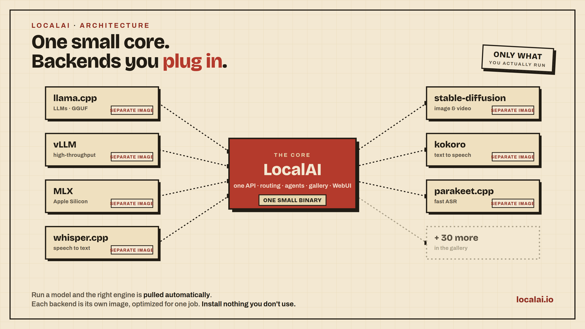

<h1 align="center">
  <br>
   <br>
<br>
</h1>

<p align="center">
<a href="https://github.com/go-skynet/LocalAI/stargazers" target="blank">

</a>
<a href='https://github.com/go-skynet/LocalAI/releases'>

</a>
<a href="LICENSE" target="blank">

</a>
</p>

<p align="center">
<a href="https://twitter.com/LocalAI_API" target="blank">

</a>
<a href="https://discord.gg/uJAeKSAGDy" target="blank">

</a>
</p>

<p align="center">
<a href="https://trendshift.io/repositories/5539" target="_blank"></a>
</p>

<!-- Keep these links, translations synced daily. -->
<p align="center">
<a href="https://zdoc.app/de/mudler/LocalAI">Deutsch</a> |
<a href="https://zdoc.app/es/mudler/LocalAI">Español</a> |
<a href="https://zdoc.app/fr/mudler/LocalAI">français</a> |
<a href="https://zdoc.app/ja/mudler/LocalAI">日本語</a> |
<a href="https://zdoc.app/ko/mudler/LocalAI">한국어</a> |
<a href="https://zdoc.app/pt/mudler/LocalAI">Português</a> |
<a href="https://zdoc.app/ru/mudler/LocalAI">Русский</a> |
<a href="https://zdoc.app/zh/mudler/LocalAI">中文</a>
</p>

**LocalAI** is the open-source AI engine. Run any model - LLMs, vision, voice, image, video - on any hardware. No GPU required.

**A small core, not a bundle.** Each backend wraps a best-in-class engine (llama.cpp, vLLM, whisper.cpp, stable-diffusion, MLX...) in its own image, pulled only when a model needs it. You install nothing you don't use.

- **Composable by design**: backends are separate and pulled on demand, so you install only what your model needs
- **Open and extensible**: load any model, or build your own backend in any language against an open interface
- **Drop-in API compatibility**: OpenAI, Anthropic, and ElevenLabs APIs across every backend
- **Any model, any modality**: LLMs, vision, voice, image, and video behind one API
- **Any hardware**: NVIDIA, AMD, Intel, Apple Silicon, Vulkan, or CPU-only
- **Multi-user ready**: API key auth, user quotas, role-based access
- **Built-in AI agents**: autonomous agents with tool use, RAG, MCP, and skills
- **Privacy-first**: your data never leaves your infrastructure



Created by [Ettore Di Giacinto](https://github.com/mudler) and maintained by the [LocalAI team](#team).

> [:book: Documentation](https://localai.io/) | [:speech_balloon: Discord](https://discord.gg/uJAeKSAGDy) | [💻 Quickstart](https://localai.io/basics/getting_started/) | [🖼️ Models](https://models.localai.io/) | [❓FAQ](https://localai.io/faq/)

## Guided tour

https://github.com/user-attachments/assets/08cbb692-57da-48f7-963d-2e7b43883c18

<details>

<summary>
Click to see more!
</summary>

#### User and auth

https://github.com/user-attachments/assets/228fa9ad-81a3-4d43-bfb9-31557e14a36c

#### Agents

https://github.com/user-attachments/assets/6270b331-e21d-4087-a540-6290006b381a

#### Usage metrics per user

https://github.com/user-attachments/assets/cbb03379-23b4-4e3d-bd26-d152f057007f

#### Fine-tuning and Quantization

https://github.com/user-attachments/assets/5ba4ace9-d3df-4795-b7d4-b0b404ea71ee

#### WebRTC

https://github.com/user-attachments/assets/ed88e34c-fed3-4b83-8a67-4716a9feeb7b

</details>

## Quickstart

### macOS

<a href="https://github.com/mudler/LocalAI/releases/latest/download/LocalAI.dmg">
  
</a>

> **Note:** The DMG is not signed by Apple. After installing, run: `sudo xattr -d com.apple.quarantine /Applications/LocalAI.app`. See [#6268](https://github.com/mudler/LocalAI/issues/6268) for details.

### Containers (Docker, podman, ...)

> Already ran LocalAI before? Use `docker start -i local-ai` to restart an existing container.

#### CPU only:

```bash
docker run -ti --name local-ai -p 8080:8080 localai/localai:latest
```

#### NVIDIA GPU:

```bash
# CUDA 13
docker run -ti --name local-ai -p 8080:8080 --gpus all localai/localai:latest-gpu-nvidia-cuda-13

# CUDA 12
docker run -ti --name local-ai -p 8080:8080 --gpus all localai/localai:latest-gpu-nvidia-cuda-12

# NVIDIA Jetson ARM64 (CUDA 12, for AGX Orin and similar)
docker run -ti --name local-ai -p 8080:8080 --gpus all localai/localai:latest-nvidia-l4t-arm64

# NVIDIA Jetson ARM64 (CUDA 13, for DGX Spark)
docker run -ti --name local-ai -p 8080:8080 --gpus all localai/localai:latest-nvidia-l4t-arm64-cuda-13
```

#### AMD GPU (ROCm):

```bash
docker run -ti --name local-ai -p 8080:8080 --device=/dev/kfd --device=/dev/dri --group-add=video localai/localai:latest-gpu-hipblas
```

#### Intel GPU (oneAPI):

```bash
docker run -ti --name local-ai -p 8080:8080 --device=/dev/dri/card1 --device=/dev/dri/renderD128 localai/localai:latest-gpu-intel
```

#### Vulkan GPU:

```bash
docker run -ti --name local-ai -p 8080:8080 localai/localai:latest-gpu-vulkan
```

### Loading models

```bash
# From the model gallery (see available models with `local-ai models list` or at https://models.localai.io)
local-ai run llama-3.2-1b-instruct:q4_k_m
# From Huggingface
local-ai run huggingface://TheBloke/phi-2-GGUF/phi-2.Q8_0.gguf
# From the Ollama OCI registry
local-ai run ollama://gemma:2b
# From a YAML config
local-ai run https://gist.githubusercontent.com/.../phi-2.yaml
# From a standard OCI registry (e.g., Docker Hub)
local-ai run oci://localai/phi-2:latest
```

To test a running LocalAI server from the terminal, open an interactive chat session from another shell. Inside the prompt, `/models` lists installed models and `/model <name>` switches between them.

```bash
# Terminal 1
local-ai run llama-3.2-1b-instruct:q4_k_m

# Terminal 2
local-ai chat --model llama-3.2-1b-instruct:q4_k_m
```

> **Automatic Backend Detection**: LocalAI automatically detects your GPU capabilities and downloads the appropriate backend. For advanced options, see [GPU Acceleration](https://localai.io/features/gpu-acceleration/).

For more details, see the [Getting Started guide](https://localai.io/basics/getting_started/).

## Latest News

- **June 2026**: New native biometric backends from the LocalAI team: [voice-detect.cpp](https://github.com/localai-org/voice-detect.cpp) for speaker recognition and voice analysis (ECAPA-TDNN, WeSpeaker, ERes2Net, CAM++, wav2vec2 age/gender/emotion) and [face-detect.cpp](https://github.com/mudler/face-detect.cpp) for face detection, recognition, demographics and anti-spoofing (SCRFD/ArcFace, YuNet/SFace). Both are from-scratch C++/ggml engines with no Python or onnxruntime at inference, self-contained GGUF weights, bit-exact parity with the reference, and GPU cuDNN parity, replacing the heavier Python `insightface` and `speaker-recognition` backends ([PR #10441](https://github.com/mudler/LocalAI/pull/10441)).
- **June 2026**: New [realtime voice assistant demo](https://github.com/localai-org/localai-realtime-demo) (a tiny Go client for the Realtime API with a full talk-back voice loop and tool calling), plus [streaming of the realtime LLM / TTS / transcription pipeline stages](https://github.com/mudler/LocalAI/pull/10176) and [configurable WebRTC ICE candidates](https://github.com/mudler/LocalAI/pull/10231).
- **June 2026**: Big speech push: the [parakeet.cpp](https://github.com/mudler/parakeet.cpp) ASR engine gains [NeMo-faithful segment timestamps](https://github.com/mudler/LocalAI/pull/10207), a [multilingual streaming Nemotron-3.5 model](https://github.com/mudler/LocalAI/pull/10199), [dynamic batching for concurrent transcription](https://github.com/mudler/LocalAI/pull/10112) and [CUDA graphs](https://github.com/mudler/LocalAI/pull/10273); the new [CrispASR backend](https://github.com/mudler/LocalAI/pull/10099) adds multi-architecture ASR + TTS, and [60 Piper TTS voices across 42 languages](https://github.com/mudler/LocalAI/pull/10296) land in the gallery (plus [per-request TTS instructions and params](https://github.com/mudler/LocalAI/pull/10172)).
- **June 2026**: New backends and models: [locate-anything.cpp](https://github.com/mudler/LocalAI/pull/10264) for open-vocabulary object detection via ggml, [Ideogram4 image generation](https://github.com/mudler/LocalAI/pull/10201) in stablediffusion-ggml, [llama.cpp video input](https://github.com/mudler/LocalAI/pull/10216), and the [Gemma 4 QAT family with MTP speculative-decoding pairs](https://github.com/mudler/LocalAI/pull/10215). Plus an [interactive CLI chat mode](https://github.com/mudler/LocalAI/pull/10226) and [RAG source citations in agent responses](https://github.com/mudler/LocalAI/pull/10228).
- **June 2026**: Distributed mode hardening: [prefix-cache-aware routing](https://github.com/mudler/LocalAI/pull/10071), a [production-ready request router with auto-sized embedding/rerank batches](https://github.com/mudler/LocalAI/pull/10104), [ds4 layer-split distributed inference](https://github.com/mudler/LocalAI/pull/10098), [NATS JWT auth + TLS/mTLS](https://github.com/mudler/LocalAI/pull/10159), and [resumable file uploads](https://github.com/mudler/LocalAI/pull/10109).
- **May 2026**: **LocalAI 4.3.0** - `llama.cpp` [prompt cache on by default](https://github.com/mudler/LocalAI/pull/9925) (repeated system prompts collapse from minutes to seconds), [keyless cosign signing of backend OCI images](https://github.com/mudler/LocalAI/pull/9823), [per-API-key + per-user usage attribution](https://github.com/mudler/LocalAI/pull/9920), Distributed v3 with [per-request replica routing](https://github.com/mudler/LocalAI/pull/9968). [Release notes](https://github.com/mudler/LocalAI/releases/tag/v4.3.0)
- **May 2026**: **LocalAI 4.2.0** - LocalAI sees and hears: [voice recognition](https://github.com/mudler/LocalAI/pull/9500), [face recognition + antispoofing liveness](https://github.com/mudler/LocalAI/pull/9480), speaker diarization. Plus [drop-in Ollama API](https://github.com/mudler/LocalAI/pull/9284), [video generation](https://github.com/mudler/LocalAI/pull/9420), redesigned UI with i18n + admin-configurable branding, vLLM at feature parity with llama.cpp, and 11 new backends. [Release notes](https://github.com/mudler/LocalAI/releases/tag/v4.2.0)
- **April 2026**: **LocalAI 4.1.0** - LocalAI becomes a control tower: distributed cluster mode with VRAM-aware smart routing + autoscaling, multi-user platform with OIDC and API keys, per-user quotas with predictive analytics, in-UI fine-tuning with TRL (auto-export to GGUF), on-the-fly quantization backend, visual pipeline editor. [Release notes](https://github.com/mudler/LocalAI/releases/tag/v4.1.0)
- **March 2026**: **LocalAI 4.0.0** - native agentic orchestration with the new [Agenthub](https://agenthub.localai.io) community hub, full React UI rewrite with Canvas mode, [MCP Apps + client-side](https://github.com/mudler/LocalAI/pull/8947) with tool streaming, [WebRTC realtime audio](https://github.com/mudler/LocalAI/pull/8790), [MLX-distributed](https://github.com/mudler/LocalAI/pull/8801). [Release notes](https://github.com/mudler/LocalAI/releases/tag/v4.0.0)
- **February 2026**: [Realtime API for audio-to-audio with tool calling](https://github.com/mudler/LocalAI/pull/6245), [ACE-Step 1.5 support](https://github.com/mudler/LocalAI/pull/8396)
- **January 2026**: **LocalAI 3.10.0** — Anthropic API support, Open Responses API, video & image generation (LTX-2), unified GPU backends, tool streaming, Moonshine, Pocket-TTS. [Release notes](https://github.com/mudler/LocalAI/releases/tag/v3.10.0)
- **December 2025**: [Dynamic Memory Resource reclaimer](https://github.com/mudler/LocalAI/pull/7583), [Automatic multi-GPU model fitting (llama.cpp)](https://github.com/mudler/LocalAI/pull/7584), [Vibevoice backend](https://github.com/mudler/LocalAI/pull/7494)
- **November 2025**: [Import models via URL](https://github.com/mudler/LocalAI/pull/7245), [Multiple chats and history](https://github.com/mudler/LocalAI/pull/7325)
- **October 2025**: [Model Context Protocol (MCP)](https://localai.io/docs/features/mcp/) support for agentic capabilities
- **September 2025**: New Launcher for macOS and Linux, extended backend support for Mac and Nvidia L4T, MLX-Audio, WAN 2.2
- **August 2025**: MLX, MLX-VLM, Diffusers, llama.cpp now supported on Apple Silicon
- **July 2025**: All backends migrated outside the main binary — [lightweight, modular architecture](https://github.com/mudler/LocalAI/releases/tag/v3.2.0)

For older news and full release notes, see [GitHub Releases](https://github.com/mudler/LocalAI/releases) and the [News page](https://localai.io/basics/news/).

## Features

- [Text generation](https://localai.io/features/text-generation/) (`llama.cpp`, `transformers`, `vllm` ... [and more](https://localai.io/model-compatibility/))
- [Text to Audio](https://localai.io/features/text-to-audio/)
- [Audio to Text](https://localai.io/features/audio-to-text/)
- [Image generation](https://localai.io/features/image-generation)
- [OpenAI-compatible tools API](https://localai.io/features/openai-functions/)
- [Realtime API](https://localai.io/features/openai-realtime/) (Speech-to-speech)
- [Embeddings generation](https://localai.io/features/embeddings/)
- [Constrained grammars](https://localai.io/features/constrained_grammars/)
- [Download models from Huggingface](https://localai.io/models/)
- [Vision API](https://localai.io/features/gpt-vision/)
- [Object Detection](https://localai.io/features/object-detection/)
- [Reranker API](https://localai.io/features/reranker/)
- [P2P Inferencing](https://localai.io/features/distribute/)
- [Distributed Mode](https://localai.io/features/distributed-mode/) — Horizontal scaling with PostgreSQL + NATS
- [Model Context Protocol (MCP)](https://localai.io/docs/features/mcp/)
- [Built-in Agents](https://localai.io/features/agents/) — Autonomous AI agents with tool use, RAG, skills, SSE streaming, and [Agent Hub](https://agenthub.localai.io)
- [Backend Gallery](https://localai.io/backends/) — Install/remove backends on the fly via OCI images
- Voice Activity Detection (Silero-VAD)
- Integrated WebUI

## Supported Backends & Acceleration

LocalAI supports **60+ backends** including llama.cpp, vLLM, SGLang, transformers, whisper.cpp, diffusers, MLX, MLX-VLM, and many more. Hardware acceleration is available for **NVIDIA** (CUDA 12/13), **AMD** (ROCm), **Intel** (oneAPI/SYCL), **Apple Silicon** (Metal), **Vulkan**, and **NVIDIA Jetson** (L4T). All backends can be installed on-the-fly from the [Backend Gallery](https://localai.io/backends/).

See the full [Backend & Model Compatibility Table](https://localai.io/model-compatibility/) and [GPU Acceleration guide](https://localai.io/features/gpu-acceleration/).

### Backends built by us

Most backends wrap a best-in-class upstream engine. A handful of them are native C/C++/GGML engines (no Python at inference) developed and maintained by the LocalAI project itself:

| Backend | What it does |
|---------|-------------|
| [parakeet.cpp](https://github.com/mudler/parakeet.cpp) | C++/GGML port of NVIDIA NeMo Parakeet ASR (tdt/ctc/rnnt/hybrid), with cache-aware streaming transcription |
| [moss-transcribe.cpp](https://github.com/localai-org/moss-transcribe.cpp) | C++/GGML port of OpenMOSS MOSS-Transcribe-Diarize: joint long-form transcription, speaker diarization and timestamping in a single pass |
| [moss-tts.cpp](https://github.com/mudler/moss-tts.cpp) | C++/GGML port of the OpenMOSS MOSS-TTS family: text-to-speech (MOSS-TTS-Local v1.5, 48 kHz stereo) with reference-audio voice cloning, through the MOSS-Audio-Tokenizer neural codec |
| [ced.cpp](https://github.com/localai-org/ced.cpp) | C++/GGML port of the CED audio-tagging models: sound-event classification (527-class AudioSet) over REST and the realtime API for live recognition |
| [voice-detect.cpp](https://github.com/localai-org/voice-detect.cpp) | Speaker recognition and voice analysis (ECAPA-TDNN, WeSpeaker, ERes2Net, CAM++, wav2vec2 age/gender/emotion), replacing the Python speaker-recognition backend |
| [voxtral-tts.c](https://github.com/mudler/voxtral-tts.c) | Voxtral Realtime 4B speech-to-text in pure C |
| [vibevoice.cpp](https://github.com/mudler/vibevoice.cpp) | Native port of Microsoft VibeVoice for TTS (voice cloning) and long-form ASR with speaker diarization |
| [rf-detr.cpp](https://github.com/localai-org/rf-detr.cpp) | Native RF-DETR object detection and instance segmentation |
| [locate-anything.cpp](https://github.com/mudler/locate-anything.cpp) | Open-vocabulary object detection and visual grounding (LocateAnything-3B) |
| [depth-anything.cpp](https://github.com/mudler/depth-anything.cpp) | Depth Anything 3 monocular metric depth + camera pose estimation |
| [face-detect.cpp](https://github.com/mudler/face-detect.cpp) | Face detection, recognition, demographics and anti-spoofing (SCRFD/ArcFace, YuNet/SFace), replacing the Python insightface backend |
| [free-splatter.cpp](https://github.com/localai-org/free-splatter.cpp) | Pose-free 3D reconstruction (FreeSplatter): turns a handful of plain photos into 3D Gaussians, no camera poses or GPU required |
| [privacy-filter.cpp](https://github.com/localai-org/privacy-filter.cpp) | Standalone GGML PII/NER token-classification engine powering LocalAI's PII redaction tier |
| [LocalVQE](https://github.com/localai-org/LocalVQE) | Joint acoustic echo cancellation, noise suppression, and dereverberation |
| [local-store](https://github.com/mudler/LocalAI) | Local-first vector database for embeddings (shipped in-tree) |

We also maintain [apex-quant](https://github.com/localai-org/apex-quant), a per-tensor, per-layer quantization recipe for Mixture-of-Experts models that exploits their structural sparsity to produce GGUFs matching or beating Q8_0 quality - and they run out of the box on stock llama.cpp.

## Resources

- [Documentation](https://localai.io/)
- [LLM fine-tuning guide](https://localai.io/docs/advanced/fine-tuning/)
- [Build from source](https://localai.io/basics/build/)
- [Kubernetes installation](https://localai.io/basics/getting_started/#run-localai-in-kubernetes)
- [Integrations & community projects](https://localai.io/docs/integrations/)
- [Installation video walkthrough](https://www.youtube.com/watch?v=cMVNnlqwfw4)
- [Media & blog posts](https://localai.io/basics/news/#media-blogs-social)
- [Examples](https://github.com/mudler/LocalAI-examples) — including the [realtime voice assistant demo](https://github.com/localai-org/localai-realtime-demo) (Go client for the Realtime API with tool calling)

## Team

LocalAI is maintained by a small team of humans, together with the wider community of contributors.

- **[Ettore Di Giacinto](https://github.com/mudler)** — original author and project lead
- **[Richard Palethorpe](https://github.com/richiejp)** — maintainer

A huge thank you to everyone who contributes code, reviews PRs, files issues, and helps users in [Discord](https://discord.gg/uJAeKSAGDy) — LocalAI is a community-driven project and wouldn't exist without you. See the full [contributors list](https://github.com/mudler/LocalAI/graphs/contributors).

## Citation

If you utilize this repository, data in a downstream project, please consider citing it with:

```
@misc{localai,
  author = {Ettore Di Giacinto},
  title = {LocalAI: The free, Open source OpenAI alternative},
  year = {2023},
  publisher = {GitHub},
  journal = {GitHub repository},
  howpublished = {\url{https://github.com/go-skynet/LocalAI}},
```

## Sponsors

> Do you find LocalAI useful?

Support the project by becoming [a backer or sponsor](https://github.com/sponsors/mudler). Your logo will show up here with a link to your website.

A huge thank you to our generous sponsors who support this project covering CI expenses, and our [Sponsor list](https://github.com/sponsors/mudler):

<p align="center">
  <a href="https://www.spectrocloud.com/" target="blank">
    
  </a>
</p>

<details>

<summary>
Past sponsors
</summary>

<p align="center">
  <a href="https://www.premai.io/" target="blank">
     <br>
  </a>
</p>

</details>

### Individual sponsors

A special thanks to individual sponsors, a full list is on [GitHub](https://github.com/sponsors/mudler) and [buymeacoffee](https://buymeacoffee.com/mudler). Special shout out to [drikster80](https://github.com/drikster80) for being generous. Thank you everyone!

## Star history

[](https://star-history.com/#go-skynet/LocalAI&Date)

## License

LocalAI is a community-driven project created by [Ettore Di Giacinto](https://github.com/mudler/) and maintained by the [LocalAI team](#team).

MIT - Author Ettore Di Giacinto <mudler@localai.io>

## Acknowledgements

LocalAI couldn't have been built without the help of great software already available from the community. Thank you!

- [llama.cpp](https://github.com/ggerganov/llama.cpp)
- https://github.com/tatsu-lab/stanford_alpaca
- https://github.com/cornelk/llama-go for the initial ideas
- https://github.com/antimatter15/alpaca.cpp
- https://github.com/EdVince/Stable-Diffusion-NCNN
- https://github.com/ggerganov/whisper.cpp
- https://github.com/rhasspy/piper
- [exo](https://github.com/exo-explore/exo) for the MLX distributed auto-parallel sharding implementation

## Contributors

This is a community project, a special thanks to our contributors!
<a href="https://github.com/go-skynet/LocalAI/graphs/contributors">
  
</a>
