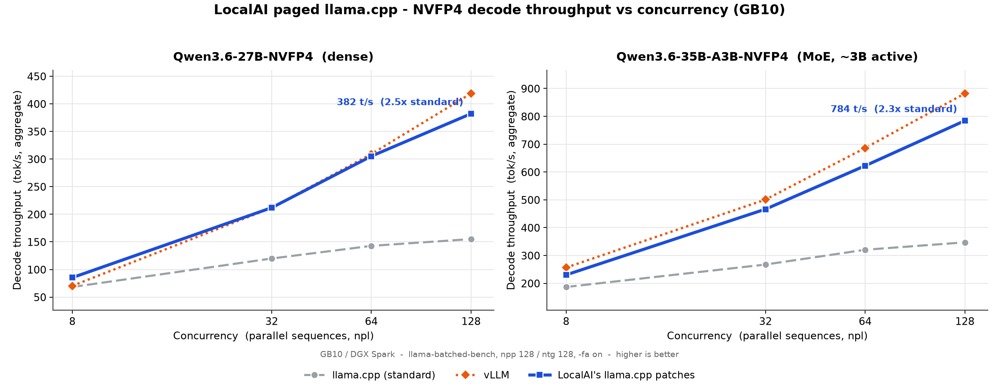

# LocalAI paged-attention llama.cpp patch series

This backend vendors the patch series (in `patches/paged/`) that turns stock
llama.cpp into LocalAI's paged-attention variant (`llama-cpp-localai-paged`). The
patches are applied on top of a pinned upstream llama.cpp at build time; nothing
here is a fork - it is a source-only `*.patch` stack plus this canonical doc.

> One-file rule: this README is the canonical reference for the patch series. The
> only other docs are operational, kept in `docs/`, and linked below:
> - [`PAGED_BITEXACT_NOTE.md`](docs/PAGED_BITEXACT_NOTE.md) - the per-path bit-exactness gate (the canonical paged-MoE md5 reference).
> - [`LOCALAI_LLAMACPP_BACKEND_PLAN.md`](docs/LOCALAI_LLAMACPP_BACKEND_PLAN.md) - the design-of-record for shipping this as its own backend + the NVFP4 gallery items.

---

## 1. What it is

`llama-cpp-localai-paged` is the LocalAI paged-attention llama.cpp backend: a
vendored patch series over upstream llama.cpp that adds

- a **paged KV cache** (vLLM-style block manager: on-demand fixed-size blocks,
  free pool, ref-counted blocks) with a **block-table flash-attention** read so
  the attention kernels index physical cells instead of a contiguous buffer;
- **cross-request prefix sharing** - concurrent requests that share a long
  prefix physically reuse one committed copy of the prefix blocks and prefill
  only their divergent suffix;
- a **decode-first prefill scheduler** - a dynamic per-step prefill-token budget
  decoupled from `n_batch`, so a long prefill never freezes co-batched decode;
- **GB10 / Blackwell NVFP4 decode optimizations** for the Qwen3.6 hybrid
  gated-DeltaNet (SSM) models, where the recurrent-state plumbing - not the FP4
  GEMM - dominates the decode step.

It is **pinned to llama.cpp `9d5d882d`** (kept == the stock `llama-cpp` backend's
pin) and advanced only by a manual, bit-exact-gated pin-sync process (see
section 7, "Pin + maintenance policy"), decoupled from the nightly auto-bumper. The pin must stay aligned with the stock pin because
`grpc-server.cpp` is shared; an earlier bump to `c299a92c` was bit-exact but broke
the grpc-server link and was reverted.

The build gate is `LLAMA_PAGED` (default on in this tree); the paged engine is
enabled per-model at runtime via the gallery `options:` knobs (`paged_kv:true`,
`max_batch_tokens:`, `kv_unified:false`, ...). Against unpatched llama.cpp the
runtime hooks are inert, so a single `grpc-server.cpp` is shared between the
clean and the paged build.

---

## 2. Architecture

The decode step on these models breaks into three cost centers; the patch series
attacks each one.

**Paged KV manager + block-table flash-attn.** A host-side `PagedKVManager`
(`FreeBlockQueue` / `BlockPool` / chained-hash content cache) hands out
fixed-size KV blocks on demand and reclaims them per-sequence (ref-counted, with
copy-on-write for shared prefixes). The attention path reads through a **block
table** - an `I32 [n_view, n_stream]` position-ordered physical-cell index passed
as `src[5]` of `ggml_flash_attn_ext` - so the CUDA fattn vec/tile kernels and the
CPU reference map logical KV index `j` to physical cell `block_table[seq*ne11+j]`
and read K/V in place. Token-position ordering keeps the flash-attn online-softmax
reduction order identical to stock. A null block table is the stock contiguous
read, byte-identical.

**The gated-DeltaNet (GDN / SSM) decode path.** The Qwen3.6 hybrid models are 48
gated-DeltaNet (linear-attention / SSM) layers + 16 full-attention layers. On
GB10 the recurrent-state plumbing, not the weight GEMM, is the dominant decode
cost. The series fuses that plumbing to mirror vLLM's
`fused_recurrent_gated_delta_rule`: the recurrent state is read from and written
to its cache slot in place (no copy-back, no `get_rows` materialization), the
conv state is updated in place, the output projection is reshaped to route to the
tensor-core MMQ GEMM, and the recurrence kernel is occupancy-retuned - all
bit-exact (md5-gateable) against the f32 baseline.

**NVFP4 native FP4-MMA on Blackwell.** The NVFP4 dense/expert weight GEMM uses
Blackwell's native FP4-MMA. The series removes a redundant activation-requantize
in the MoE broadcast projections (bit-exact byte copy of identical blocks) and
keeps CUDA graphs on for the grouped-MMQ MoE decode step. These are the only
NVFP4-specific optimizations; on non-Blackwell hardware the FP4 path falls back
to dequant.

**The prefill/decode scheduler.** `update_slots()` already emits one unified
mixed prefill+decode batch per step. The scheduler patches change only the *count*
of prefill tokens admitted per step: decode tokens are claimed first
(decode-first), then a dynamic budget `max(n_ubatch, T - D)` (where `D` is the
live decode load and `T` is `LLAMA_MAX_BATCH_TOKENS`) admits prefill, auto-
shrinking as decode load rises. Pure scheduler policy, byte-identical when off,
orthogonal to the paged allocator.

---

## 3. Patch series (0001-0031)

29 patches (0005 and 0027 are intentionally unused). "Bit-exact" = greedy md5 /
`test-backend-ops` byte-identical to the relevant baseline; the gate methodology
is in section 5.

### Paged-KV core (0001-0012)

| # | What it does | Bit-exact |
|---|---|---|
| 0001 | Vendor the host-side paged KV block manager (`FreeBlockQueue`, `BlockPool`, `PagedKVManager`, chained-hash prefix cache). Pure C++17, nothing uses it yet. | n/a (no behavior) |
| 0002 | Place each sequence at permuted, non-contiguous block positions in `find_slot` (proves attention is invariant to physical KV placement). | yes (token-identical) |
| 0003 | Gather K/V/mask down to each stream's non-empty cells before `build_attn_mha`, position-sorted so the FA reduction order matches stock. | yes |
| 0004 | Drive paged placement through the vendored manager: blocks popped on demand, returned on seq end. Core kv-cache struct untouched. | yes (stock path byte-identical) |
| 0006 | Host-side cross-request prefix caching: hash prefix blocks, reuse matching physical blocks (ref-count++), COW-privatise before a divergent write. | yes (default off) |
| 0007 | Wire the prefix cache into the engine so a new sequence physically shares cached prefix blocks and skips recomputing the shared prefix. | yes (verified byte-identical) |
| 0008 | Wire cross-request prefix share into the llama-server continuous-batch loop so concurrent shared-prefix requests prefill only the suffix (36x fewer prefill tokens at K=32). | within CUDA batch-shape non-determinism band |
| 0009 | Replace the per-step gather with an **in-kernel paged read** (block table as `src[5]`); the K/V `get_rows` is gone. Decode step at batch32 691->696ms (was 1279ms gathered). | yes on CPU/batch1; GPU batch>1 within vec-vs-mma band |
| 0010 | Graft the block-table read into the tile kernel; add a dispatch guard so a present block table routes ONLY to vec/tile (never the mma/wmma kernels that ignore it). | yes (CPU byte-identical; vec route) |
| 0011 | Route the GQA-grouped F16 decode to the **tile kernel** (native head-group reuse) by default; vec for everything else. Paged decode to within 1.8% of stock. | vs stock-mma: different-kernel rounding; bit-exact vs vec |
| 0012 | Defensive `GGML_ASSERT(n_view % 64 == 0)` so a future pad/tile change can't silently reintroduce a past-end KV leak on the tile route. | yes (additive assert) |

### Decode-first scheduler (0013, 0016)

| # | What it does | Bit-exact |
|---|---|---|
| 0013 | `LLAMA_PREFILL_BUDGET`: a static per-step prefill-token budget decoupled from `n_batch` (vLLM `--max-num-batched-tokens` analogue). Flattens the decode ITL spike a long prefill inflicts (8.5x smaller worst freeze). | yes (off/short = byte-identical; == `-b` chunking) |
| 0016 | Supersede 0013 with a **dynamic decode-first** budget: `max(n_ubatch, T-D)`, auto-shrinking as decode load `D` rises. Policy-only inside `update_slots()`, zero libllama changes. | yes (default-off byte-identical) |

(0014/0015 are the MoE token-tile levers: 0014 adds `LLAMA_MOE_MMQ_X` (opt-in
high-batch decode micro-opt, +4.8% on Qwen3-Coder-30B), 0015 makes it a
default-on, density-aware auto-select that is prefill-safe by construction. Both
bit-exact. 0017 is the dense FP4-GEMM occupancy-tune track: bit-exact gate green,
but every cheap occupancy lever regressed on GB10, so nothing is enabled - it
ships as the parity gate + default-off instrumentation only.)

### SSM (gated-DeltaNet) decode levers (0018-0022, 0028)

These are the dominant decode levers on the Qwen3.6 hybrid models. All bit-exact.

| # | What it does | Effect (dense q36-27b / MoE q36-35b-a3b @npl128) |
|---|---|---|
| 0018 | **In-place SSM state write-back** - the recurrence writes its final state directly into the cache slot, removing the ~225MB/copy D2D memcpy (18.9% of decode time). | dense +23.5% / MoE +18.9% |
| 0019 | **Fused recurrent-state gather** - the op reads each sequence's prior state directly from `cache[ids[seq]]` (no `get_rows` materialization); race-free in-place + ids read. | dense +37.8% / MoE +35.3% |
| 0020 | **o_proj MMVQ->MMQ reshape** - collapse the GDN output to 2D so the output projection routes to the M=128 tensor-core MMQ GEMM (was a batch<=8 MMVQ GEMV). The single biggest decode-parity lever. | dense +31.7% (->85.9% of vLLM) / MoE +23.3% |
| 0021 | **Conv-state in-place fusion** - one `ggml_ssm_conv_update_inplace` op replaces the 4-op conv chain (transpose+concat+conv+silu+ring-cpy), writing the shifted ring state in place. | dense +3.2% / MoE +3.5% |
| 0022 | **GDN recurrence occupancy/coalescing retune** - column-folding (NUM_WARPS/COLS_PER_WARP) raises memory-level parallelism on the bandwidth-bound B=128 recurrence kernel; per-column f32 FMA order unchanged. 73.4%->84.6% of GB10 peak BW. | dense +11.1% / MoE +8.3% |
| 0028 | **Recurrent conv-tap gather fusion** - the last `k_get_rows` in the GDN decode path (the conv-state tap gather) becomes an indexed in-kernel read. | dense ~377 t/s / MoE ~784 t/s |

### MoE NVFP4 quant (0023, 0025)

| # | What it does | Bit-exact |
|---|---|---|
| 0023 | **NVFP4 activation-quantize de-dup** - the broadcast up/gate projections re-quantize the same token activation once per expert; quantize the unique token activations once and byte-copy them into the expert-gathered layout. The only NVFP4-specific patch. | yes (byte-identical) |
| 0025 | **MoE decode re-graph** - keep CUDA graphs on for the grouped-MMQ MoE decode step (the upstream guard disables graphs conservatively; the grouped path has no host sync). Env-gated `LLAMA_MOE_FORCE_GRAPHS`. | yes (graph replay re-issues identical kernels) |

### Pool reclaim, block-table cache, backend gate

| # | What it does | Bit-exact |
|---|---|---|
| 0024 | **Paged-pool burst-reclaim** - truncate trailing blocks on partial-tail `seq_rm`, defrag the free queue when idle, release blocks on slot completion. Fixes the long-server burst-degradation bug (post-burst prefill collapse 488->44 t/s, restored to 532). Host-side accounting only. | yes |
| 0029 | **Block-table within-step host cache** - the block table is fixed for the whole step; cache it on first build and memcpy it for the other full-attention layers (get_block_table -87%/-91%). | yes, per path (paged-MoE ref `8cb0ce23`) |
| 0030 | **Fused-op backend gate** - the fused GDN / discriminated SSM_CONV ops are CUDA-family + CPU only; force them off on any non-CUDA compute backend so a Vulkan/SYCL/Metal build can't silently run the wrong plain-conv kernel. | yes on CUDA (byte-identical pre-0030); safety gate elsewhere |
| 0031 | **Chunked parallel-scan GDN prefill kernel** (upstream TODO) - FLA-style chunked gated-delta-rule for prefill (non-KDA / f32 / final-state): intra-chunk delta rule solved in parallel (UT-transform + forward subst), inter-chunk recurrence over n_tokens/C steps. **OPT-IN, default OFF** - bit-exact-benign but not yet faster than the tuned sequential scan at the GB10-forced C=16 (see section 5). Enable with `GDN_CHUNK_MIN=<n>`. | NEW per-path (`test-backend-ops` 91/91, <=1e-7 NMSE vs CPU ref) |

> **Dropped: patch 0026 (hybrid per-head bf16 SSM state, `ssm_bf16_tau`).** Once
> the decode fusions (0028 recurrent-state gather-fusion + 0029 block-table cache)
> landed, the bf16-SSM lever bought nothing: a clean re-measurement forcing **all**
> gated-DeltaNet heads to bf16 (`tau=100000`) gives **flat** decode (780.6 vs
> 780.0 t/s) - the mode engages but adds zero throughput because it is subsumed by
> the fusions. It was a precision trade (not bit-exact) plus extra bug surface and
> CUDA template-instantiation compile cost with no benefit, so it was removed. See
> section 5 ("rejected / flat levers") for the full record.

---

## 4. Benchmarks

Hardware: **GB10 / DGX Spark** (CUDA 13, sm_121). Models: dense
**Qwen3.6-27B-NVFP4** and MoE **Qwen3.6-35B-A3B-NVFP4**. Metric: `decode_agg`
S_TG (t/s) from `llama-batched-bench`, `-fa on -ngl 99`, `npp 128 / ntg 128`,
swept over serving width `npl` in {8, 32, 64, 128}. Plots:
[`qwen36_decode_overview.png`](docs/qwen36_decode_overview.png) (both models),
[`qwen36_dense_decode_vs_npl.png`](docs/qwen36_dense_decode_vs_npl.png),
[`qwen36_moe_decode_vs_npl.png`](docs/qwen36_moe_decode_vs_npl.png); raw data
[`final_benchmark.csv`](docs/final_benchmark.csv).

> The plot above also shows a third "bf16-tau" llama curve. That was the opt-in
> `ssm_bf16_tau` lever (patch 0026), since **dropped** - a clean re-measurement
> showed it flat once the decode fusions landed (see section 5). The numbers below
> use only **stock** vs **patched** vs **vLLM**.

> **What was re-measured (2026-06-27).** The two llama columns - **stock** and
> **patched** - were re-measured this session on one consistent
> `llama-batched-bench` harness. The **vLLM** column is the **prior-session
> reference** (kept as-is, *not* re-run this session). Per-run peak
> VRAM was *not* re-captured: the GB10's unified Grace-Blackwell LPDDR5x reports
> `[N/A]` to `nvidia-smi --query-gpu=memory.used` and the bench does not print it
> (the memory-advantage note below is the prior-session finding).

### (a) + (b) Patched vs stock vs vLLM

The **stock** column is a separate, unpatched llama.cpp built at this backend's
**exact pin (`9d5d882d`)**; the **patched** column is
the paged binary, env/flag-toggled (`LLAMA_KV_PAGED=1`, plus
`LLAMA_MOE_FORCE_GRAPHS=1` for MoE). Both
run on the **same harness**, so "x over stock" is an apples-to-apples measure of
the patch series. (Note: the patch series' dominant SSM decode fusions are
compiled in, not env-gated - toggling `LLAMA_KV_PAGED` alone on the *patched*
binary does **not** reproduce stock; only the separately-built unpatched
`9d5d882d` binary does.) The **vLLM** column is a **different harness** (vLLM
server + client continuous batching) and a **prior-session reference**, so the
cross-engine "% of vLLM" is **indicative, not apples-to-apples**.

**Dense Qwen3.6-27B-NVFP4** (decode t/s):

| npl | stock | patched | vLLM (prior) | patched x over stock |
|----:|------:|--------:|-------------:|---------------------:|
| 8   |  68.3 |   85.3 |         70.4 | 1.25x |
| 32  | 119.9 |  211.9 |        211.8 | 1.77x |
| 64  | 142.8 |  305.2 |        309.1 | 2.14x |
| 128 | 155.1 |  382.1 |        418.8 | 2.46x |

Dense **patched** is parity-to-ahead of vLLM (121 / 100 / 99 / 91% of vLLM across
the widths).

**MoE Qwen3.6-35B-A3B-NVFP4** (decode t/s):

| npl | stock | patched | vLLM (prior) | patched x over stock |
|----:|------:|--------:|-------------:|---------------------:|
| 8   | 186.7 |  230.3 |        256.5 | 1.23x |
| 32  | 267.4 |  466.4 |        500.8 | 1.74x |
| 64  | 320.5 |  622.4 |        686.1 | 1.94x |
| 128 | 347.2 |  784.3 |        882.2 | 2.26x |

MoE **patched** is 90 / 93 / 91 / 89% of vLLM.

**Caveat on the vLLM column.** It is a **different harness** and a
**prior-session** measurement (not re-run this session), so the cross-engine "% of
vLLM" is **indicative, not apples-to-apples**. Memory (prior session): llama uses
**1.5-3x lower** memory than vLLM.

**Takeaway.** Re-measured this session, the patch series gives up to **2.46x
(dense) / 2.26x (MoE)** over true-stock `9d5d882d` on the same harness (close to,
slightly below, the prior 2.59x / 2.33x - llama was re-measured, vLLM kept).
Dense is parity-to-ahead of vLLM; MoE **patched** sits at ~89-93% of the
prior-session vLLM. The residual MoE gap is structural (see section 5).

### (c) Apple Silicon (M4, 16GB Metal) - does the patchset help here?

Short answer: **no - the wins are CUDA/Blackwell-specific.** Two facts first: the
24GB NVFP4 GGUF doesn't fit a 16GB M4 (SSD paging), and on Metal `supports_op`
**excludes NVFP4** from `MUL_MAT`/`MUL_MAT_ID`/`GET_ROWS` (FP4 matmuls fall back to
CPU - no Apple FP4-MMA). So NVFP4 Qwen3.6 is not a Mac fit; a Metal-native Q4_K is.

Measured **stock vs patched** (same pin `c299a92c`, both built `-DGGML_METAL=ON`;
the 28-patch series **compiles clean on Metal** - the CUDA code is `#if`-guarded),
on **Qwen3-8B Q4_K_M** (a dense GQA model that fits 16GB and exercises the *live*
Metal features; no Qwen3.6 hybrid GGUF fits 16GB, and the GDN fusions gate off on
Metal anyway), `llama-bench` pp512/tg128 t/s:

| config | pp512 | tg128 |
|---|---:|---:|
| stock | 226.7 | 20.4 |
| patched, paged **off** | 226.7 | 20.3 (= stock) |
| patched, paged **on** | 222.6 | 19.8 (~0.97x) |

Concurrency (`batched-bench`) scales identically to stock (S_TG ~20 -> ~137 at
npl32, from llama.cpp's existing batching). **Verdict: neutral-to-slightly-negative
on Metal.** Patched-paged-off equals stock; turning paged on is ~0-3% slower
decode / ~2-8% slower prefill, because the in-kernel block-table flash-attn read
that *recovers* the gather cost is CUDA-only (`fattn-*.cuh`) - on Metal the paged
path falls back to a host-side gather, pure overhead over stock's contiguous read.
Everything Blackwell-specific (NVFP4, GDN fusions via 0030, occupancy) is inert.
So **on Apple Silicon, prefer the stock `llama-cpp` backend.**

**Vulkan / SYCL** (source analysis): the gated-DeltaNet and SSM_CONV ops DO have
upstream kernels on Vulkan and SYCL (as on Metal), so the Qwen3.6 hybrids RUN on
all three via the non-fused path. The patchset's fusions are gated off there
(0030), so the outcome is the same neutral-to-slightly-negative as Metal - not
"won't run". This backend therefore ships **CUDA-only** (where the fusions are
live + verified); non-CUDA users should use the stock `llama-cpp` backend. See
[`UPSTREAM_LAYER2_SCOPE.md`](docs/UPSTREAM_LAYER2_SCOPE.md) for what native non-CUDA
fused kernels would take.

---

## 5. Dev notes - what we learned

**Bit-exact methodology.** Every bit-exact patch is gated two ways: (1) a greedy
md5 gate - `llama-completion -m MODEL -ngl 99 -fa on -p "The capital of France
is" -n 48 --temp 0 --seed 1 | md5sum`, paged paths prefixed with
`LLAMA_KV_PAGED=1` (+ `LLAMA_MOE_FORCE_GRAPHS=1` for paged MoE), on the default
chat-template path; and (2) `test-backend-ops` (CUDA0 vs CPU oracle) for every
touched op (`SSM_CONV*`, `GATED_DELTA_NET`, `MUL_MAT`, `MUL_MAT_ID`).

**The gate is per-path** (see [`PAGED_BITEXACT_NOTE.md`](docs/PAGED_BITEXACT_NOTE.md)).
Dense is bit-exact across paged/non-paged (`5951a5b4`). The **paged MoE** md5
(`8cb0ce23`) does **not** byte-match the **non-paged MoE** md5 (`07db32c2`); this
is a benign FP-accumulation-order difference of the paged attention reduction,
**KL-validated** against the f16 reference: KLD(paged||f16) 0.13600 <=
KLD(nonpaged||f16) 0.13660, PPL within +/-0.29, ~zero probability bias - two
equivalent FP-reorderings of the same quantized model, not a regression. Future
paged-MoE regressions therefore compare to `8cb0ce23`, not `07db32c2`.

**MoE-parity conclusion** (the residual gap is structural). The two heaviest MoE
decode kernels - the GDN-SSM recurrence and the NVFP4-expert GEMM - are llama
**wins** after this series (the recurrence runs at 102.6% of vLLM's bandwidth;
the GEMM ties vLLM at the LPDDR5x BW floor). The residual gap is **bf16-projection
bandwidth + the host scheduling loop**, both at the LPDDR5x floor - not a kernel
llama is losing. The MoE GEMM kernel is *not* where the gap lives.

**Rejected / flat levers** (recorded so they are not re-tried):

- **Lever 2 - graph/stream coverage: FLAT.** Bit-exact graph coverage was
  exhausted by 0025; more graph/stream overlap is a no-op or small regression on
  this model.
- **Lever 3 - act-quant fusion: FLAT.** The W4A4 act-quant tax is removable only
  by W4A16 (a precision change, rejected) or a structural kernel rewrite; no
  further bit-exact lever clears it. 0023 already banks the de-dup.
- **Lever 4 - NVFP4 the bf16 GDN/attn projections: REJECTED (KL-gate fail).**
  Quantizing the projections to NVFP4 costs ~+6% PPL; vLLM deliberately keeps the
  same bf16 projections. No-ship.
- **W4A16-Marlin MoE GEMM: REJECTED.** It would be a precision upgrade nobody
  needs bought with a ~5% slower kernel; both kernels are already at the BW floor.
  (The "the win was NVFP4-dense-quant, not the Marlin kernel" dense verdict
  carries over to MoE.)
- **Chunked parallel-scan GDN prefill (patch 0031): CORRECT, FLAT-to-SLOWER at
  C=16; kept OPT-IN.** Implements the upstream "faster pre-fill" TODO - the
  FLA-style chunked gated-delta-rule (intra-chunk delta rule solved in parallel
  via the UT-transform + forward substitution, inter-chunk recurrence over
  n_tokens/C steps). The math is validated equivalent (numpy f32 NMSE ~1e-13;
  `test-backend-ops` 91/91 within the 1e-7 NMSE gate, a NEW per-path result).
  **But GB10's 99KB dynamic-smem opt-in forces C=16** (the 128x128 f32 state alone
  is 64KB of the all-shared layout), which pins the kernel to 1 block/SM and
  serial per-thread dk-reductions; measured S_PP (q36-27b-nvfp4, `-npp 512 -ntg 4
  -npl 32`) is **~761 t/s chunked vs ~971 t/s sequential (~22% slower)**, also
  grid-starved at low n_seqs. So it ships default-OFF (`GDN_CHUNK_MIN=<n>` to
  enable). To actually beat the (already 84.7%-of-peak) sequential scan the
  follow-up must lift the occupancy ceiling and the serial reductions: either
  register-resident state with static-unrolled larger chunks, or tensor-core
  (mma/wgmma) matmuls for the KK/QK/KS/QS/PU products and the A-inverse - the
  structure FLA/vLLM use. Lesson: at this head dim the win needs tensor cores,
  not just chunking.

**Opt-in bf16-SSM fast mode - DROPPED (was patch 0026, `ssm_bf16_tau`).** The
design premise - that bf16 KL error concentrates in long-memory heads and can be
removed by keeping them f32 - was already shaky: the error scales with the bf16
head *count* and saturates (~0.06 MeanKLD / ~91% same-top-p) far below any useful
byte saving. The lever was then **removed entirely** once the decode fusions
(0028 recurrent-state gather-fusion + 0029 block-table cache) landed: a clean
re-measurement that forced **all** gated-DeltaNet heads to bf16 (`tau=100000`,
the most aggressive setting) gave **flat** decode throughput - **780.6 vs 780.0
t/s**. The mode engages but buys **zero** speed; the earlier "+12%" was subsumed
by the fusions. So bf16-tau was a precision trade (not bit-exact) plus extra bug
surface and CUDA template-instantiation compile cost with **no** offsetting
benefit, and patch 0026 was dropped from the series. Lesson recorded so it is not
re-tried: do not reintroduce a per-head SSM-precision lever - the bandwidth it
targeted is already recovered by the gather-fusion + block-table cache.

---

## 6. Architecture and quant generality

(From the arch-generality and quant-generality audits.)

- **15 of 16 optimizations are quant-AGNOSTIC.** Only **0023** (NVFP4
  activation-quantize de-dup) is NVFP4-specific. The SSM/paged/MMQ optimizations
  help **any quant** of these models (the GDN recurrence, conv, gather and
  o_proj-MMQ levers operate on the f32 recurrent state and the routing layout,
  not on the weight dtype).
- **Arch-safe to build everywhere.** NVFP4 use is Blackwell-gated and falls back
  to dequant on other hardware; the GB10-tuned occupancy params (0022) are
  perf-only and env-selectable (`GDN_NW` / `GDN_CPW`), so they never change
  correctness on other GPUs. Patch 0030 makes the fused-op emission CUDA-family +
  CPU only, so a non-CUDA paged build routes to the safe upstream non-fused path.

- **What generalizes beyond this backend (upstream candidates).** The *speedups*
  are CUDA/Blackwell-specific (which is why Metal/Vulkan don't benefit - section
  4c), but several *findings and ops* are portable and worth upstreaming:
  - The headline is hardware-independent: on hybrid gated-DeltaNet models, decode
    is bottlenecked by the recurrent-state **plumbing** (memcpy + gathers, ~67% of
    the step), not the weight GEMM. The fusions for it (in-place state 0018, gather
    0019/0028, conv 0021) are bit-exact and already have CPU reference kernels, so
    they would speed up Qwen3.6 / Qwen3-Next / any hybrid-SSM decode on **every**
    backend once the ggml ops gain the respective (Metal/Vulkan) kernels - the
    highest-value upstream contribution.
  - The o_proj GEMV->MMQ reshape (0020) is a model-graph fix (batch the projection
    to hit the GEMM path) - arch-agnostic in principle, trivial to upstream.
  - The paged KV + cross-request prefix sharing + decode-first scheduler align with
    llama.cpp's own in-progress KV / chunked-prefill work and could inform it.
  - The per-path bit-exact md5 gate + the weekly upstream-drift canary is a reusable
    maintenance pattern for any vendored-patch backend.

---

## 7. Pin + maintenance policy

- **Pinned to llama.cpp `9d5d882d`** (kept == the stock `llama-cpp` pin). The pin
  is advanced **only** by the manual pin-sync process (this section):
  rebase the source-only patch series onto the new tip, rebuild on GPU, pass the
  bit-exact gate on every path (dense + MoE, paged + non-paged) plus
  `test-backend-ops`, **and confirm the full grpc-server build links on CI**.
- **The pin must track the stock pin.** `grpc-server.cpp` is shared with the stock
  backend and tracks the stock pin, so a paged pin that diverges past an upstream
  server-API refactor breaks the grpc-server LINK even when the patches are
  bit-exact. A bump to `c299a92c` (23 commits ahead of stock) was greedy-md5
  bit-exact but failed to link (undefined `stream_*` server helpers introduced by
  the refactor), and was reverted to `9d5d882d`. The bit-exact gate alone does not
  catch this; only the full CI grpc-server build does.
- **Decoupled from the nightly auto-bumper.** There is deliberately **no**
  `bump_deps.yaml` entry for this backend - a naive `LLAMA_VERSION` bump could
  silently shift the tree out from under the patches.
- **Weekly canary.** [`.github/workflows/llama-cpp-paged-canary.yml`](../../../.github/workflows/llama-cpp-paged-canary.yml)
  (via [`.github/scripts/paged-canary-apply.sh`](../../../.github/scripts/paged-canary-apply.sh))
  tries the patch series against the latest upstream tip with the build's own
  strict `git apply`. **Red = upstream drifted past the series -> run a
  PIN_SYNC** (do not bump the pin blindly), following the policy in this section.

---

## 8. Models

> **Build coverage: CUDA-only.** This backend ships only the CUDA/cublas build
> targets (cuda-12, cuda-13, and the nvidia-l4t arm64 cuda-12/cuda-13 Jetson
> rows). There are no cpu / vulkan / sycl / hipblas / metal-darwin builds: the
> patchset's wins are CUDA/Blackwell-specific (section 4c), so off-CUDA the
> backend is neutral-to-negative and non-CUDA users should run the stock
> `llama-cpp` backend instead. The `backend/index.yaml` meta-backend resolves
> `default`/`nvidia` to a CUDA variant accordingly.

The benchmarked NVFP4 GGUFs are published and wired into the LocalAI gallery:

| Gallery entry | Weights (HuggingFace) | Notes |
|---|---|---|
| `qwen3.6-27b-nvfp4-paged` | [`mudler/Qwen3.6-27B-NVFP4-GGUF`](https://huggingface.co/mudler/Qwen3.6-27B-NVFP4-GGUF) | Dense, native Blackwell NVFP4 (FP4-MMA). |
| `qwen3.6-35b-a3b-nvfp4-paged` | [`mudler/Qwen3.6-35B-A3B-NVFP4-GGUF`](https://huggingface.co/mudler/Qwen3.6-35B-A3B-NVFP4-GGUF) | MoE (256 experts, top-8), `file_type MOSTLY_NVFP4`. |

Both gallery entries set `backend: llama-cpp-localai-paged` and the paged serving config
(`paged_kv:true`, `max_batch_tokens`, `kv_unified:false`, `parallel`,
`flash_attention:on`, `context_size`). They are bit-exact. The full
backend-split + gallery plan is in
[`LOCALAI_LLAMACPP_BACKEND_PLAN.md`](docs/LOCALAI_LLAMACPP_BACKEND_PLAN.md).
