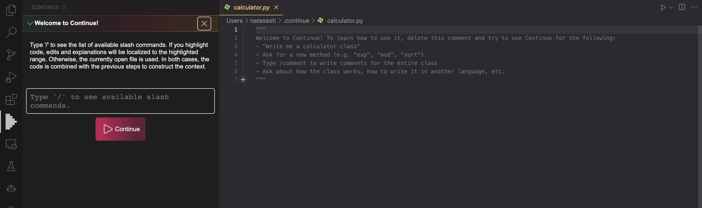

# Examples

| [ChatGPT OSS alternative](https://github.com/go-skynet/LocalAI/tree/master/examples/chatbot-ui)                                                                                                                | [Image generation](https://localai.io/api-endpoints/index.html#image-generation)                                                                                                              |
|------------------------------------------------------------------------------------------------------------------------|------------------------------------------------------------------------------------------------------------------------|
|              |                   |

|                                                                    [Telegram bot](https://github.com/go-skynet/LocalAI/tree/master/examples/telegram-bot)   | [Flowise](https://github.com/go-skynet/LocalAI/tree/master/examples/flowise)                                                                                                                     |
|------------------------------------------------------------------------------------------------------------------------|------------------------------------------------------------------------------------------------------------------------|
   |  |    |

Here is a list of projects that can easily be integrated with the LocalAI backend. 

### Projects

### AutoGPT

_by [@mudler](https://github.com/mudler)_

This example shows how to use AutoGPT with LocalAI.

[Check it out here](https://github.com/go-skynet/LocalAI/tree/master/examples/autoGPT/)

### Chatbot-UI

_by [@mkellerman](https://github.com/mkellerman)_

This integration shows how to use LocalAI with [mckaywrigley/chatbot-ui](https://github.com/mckaywrigley/chatbot-ui).

[Check it out here](https://github.com/go-skynet/LocalAI/tree/master/examples/chatbot-ui/)

There is also a separate example to show how to manually setup a model: [example](https://github.com/go-skynet/LocalAI/tree/master/examples/chatbot-ui-manual/)

### K8sGPT

_by [@mudler](https://github.com/mudler)_

This example show how to use LocalAI inside Kubernetes with [k8sgpt](https://k8sgpt.ai).

### Flowise

_by [@mudler](https://github.com/mudler)_

This example shows how to use [FlowiseAI/Flowise](https://github.com/FlowiseAI/Flowise) with LocalAI.

[Check it out here](https://github.com/go-skynet/LocalAI/tree/master/examples/flowise/)

### Discord bot

_by [@mudler](https://github.com/mudler)_

Run a discord bot which lets you talk directly with a model

[Check it out here](https://github.com/go-skynet/LocalAI/tree/master/examples/discord-bot/), or for a live demo you can talk with our bot in #random-bot in our discord server.

### Langchain

_by [@dave-gray101](https://github.com/dave-gray101)_

A ready to use example to show e2e how to integrate LocalAI with langchain

[Check it out here](https://github.com/go-skynet/LocalAI/tree/master/examples/langchain/)

### Langchain Python

_by [@mudler](https://github.com/mudler)_

A ready to use example to show e2e how to integrate LocalAI with langchain

[Check it out here](https://github.com/go-skynet/LocalAI/tree/master/examples/langchain-python/)

### LocalAI functions

_by [@mudler](https://github.com/mudler)_

A ready to use example to show how to use OpenAI functions with LocalAI

[Check it out here](https://github.com/go-skynet/LocalAI/tree/master/examples/functions/)

### LocalAI WebUI

_by [@dhruvgera](https://github.com/dhruvgera)_

A light, community-maintained web interface for LocalAI

[Check it out here](https://github.com/go-skynet/LocalAI/tree/master/examples/localai-webui/)

### How to run rwkv models

_by [@mudler](https://github.com/mudler)_

A full example on how to run RWKV models with LocalAI

[Check it out here](https://github.com/go-skynet/LocalAI/tree/master/examples/rwkv/)

### PrivateGPT

_by [@mudler](https://github.com/mudler)_

A full example on how to run PrivateGPT with LocalAI

[Check it out here](https://github.com/go-skynet/LocalAI/tree/master/examples/privateGPT/)

### Slack bot

_by [@mudler](https://github.com/mudler)_

Run a slack bot which lets you talk directly with a model

[Check it out here](https://github.com/go-skynet/LocalAI/tree/master/examples/slack-bot/)

### Slack bot (Question answering)

_by [@mudler](https://github.com/mudler)_

Run a slack bot, ideally for teams, which lets you ask questions on a documentation website, or a github repository.

[Check it out here](https://github.com/go-skynet/LocalAI/tree/master/examples/slack-qa-bot/)

### Question answering on documents with llama-index

_by [@mudler](https://github.com/mudler)_

Shows how to integrate with [Llama-Index](https://gpt-index.readthedocs.io/en/stable/getting_started/installation.html) to enable question answering on a set of documents.

[Check it out here](https://github.com/go-skynet/LocalAI/tree/master/examples/query_data/)

### Question answering on documents with langchain and chroma

_by [@mudler](https://github.com/mudler)_

Shows how to integrate with `Langchain` and `Chroma` to enable question answering on a set of documents.

[Check it out here](https://github.com/go-skynet/LocalAI/tree/master/examples/langchain-chroma/)

### Telegram bot

_by [@mudler](https://github.com/mudler)

Use LocalAI to power a Telegram bot assistant, with Image generation and audio support!

[Check it out here](https://github.com/go-skynet/LocalAI/tree/master/examples/telegram-bot/)

### Template for Runpod.io

_by [@fHachenberg](https://github.com/fHachenberg)_

Allows to run any LocalAI-compatible model as a backend on the servers of https://runpod.io

[Check it out here](https://runpod.io/gsc?template=uv9mtqnrd0&ref=984wlcra)

### Continue

_by [@gruberdev](https://github.com/gruberdev)_

Demonstrates how to integrate an open-source copilot alternative that enhances code analysis, completion, and improvements. This approach seamlessly integrates with any LocalAI model, offering a more user-friendly experience.

[Check it out here](https://github.com/go-skynet/LocalAI/tree/master/examples/continue/)

## Want to contribute?

Create an issue, and put `Example: <description>` in the title! We will post your examples here.
